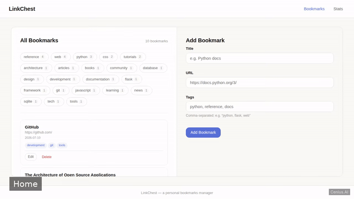
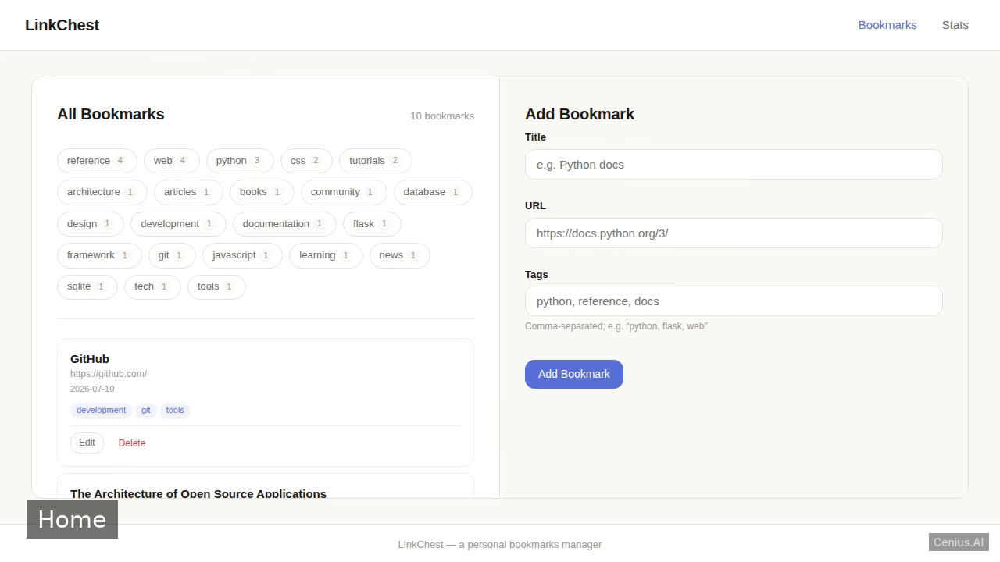
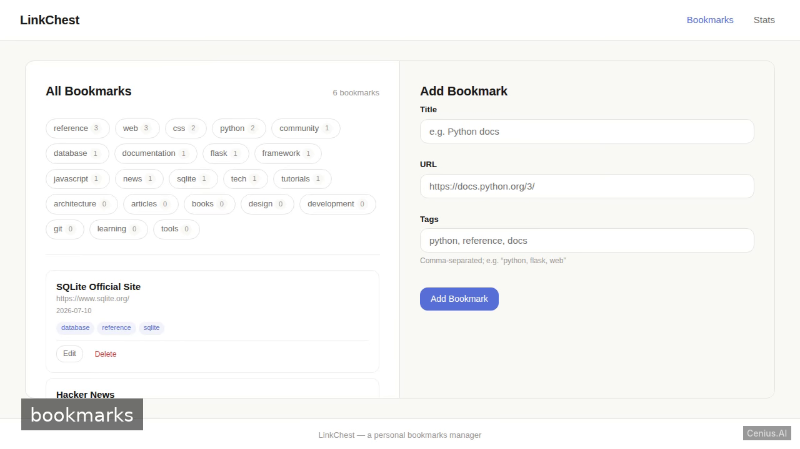

# Personal Bookmark Manager — production-ready Flask bookmark knowledge base app starter

Want to run your own knowledge base app without paying for SaaS? **Personal Bookmark Manager** is a free, Apache-2.0-licensed Flask project that you can clone and self-host today. A lightweight, server-rendered web application for a single user to manage personal bookmarks. Every Personal Bookmark Manager feature — every screen, every seed record — is here. [Open Personal Bookmark Manager on cenius.ai](https://cenius.ai/marketplace/p/personal-bookmark-manager?ref=gh&utm_campaign=personal-bookmark-manager-flask) to modify it without writing code.


[](LICENSE)  [](https://cenius.ai)

[](https://cenius.ai/marketplace/p/personal-bookmark-manager?ref=gh&utm_campaign=personal-bookmark-manager-flask)

> **▶ [Open & edit in cenius.ai](https://cenius.ai/marketplace/p/personal-bookmark-manager?ref=gh&utm_campaign=personal-bookmark-manager-flask)** — one click to an editable workspace: describe changes in plain English, get an instant preview, one-click deploy and host. Modifications made on the platform come with full rebrand & relicense rights.

_Local clone? See [Quick start](#quick-start) below. cenius.ai is the zero-setup path._

## Demo



📽 **[Demo video on cenius.ai](https://cenius.ai/marketplace/p/personal-bookmark-manager?ref=gh&utm_campaign=personal-bookmark-manager-flask)** — the complete run-through · [MP4](.github/media/demo.mp4)

## Screenshots

  

## Usage guide

The application runs as a local web server. Once started, open your browser to `http://localhost:5000` for the interactive UI. Below are examples of how to interact with it via HTTP requests.

### Main page (bookmark list)

- **View all bookmarks**  
  `GET /bookmarks` or `GET /` (redirects to `/bookmarks`)

- **Filter by tag**  
  `GET /bookmarks?tag=coding`

- **Add a bookmark** (server‑side form submission)  
  ```bash
  curl -X POST http://localhost:5000/bookmarks \
    -d "title=Flask Docs" \
    -d "url=https://flask.palletsprojects.com" \
    -d "tags=python,web"
  ```
  The form expects fields `title`, `url`, and `tags` (comma-separated). After successful creation, you are redirected back to the list.

- **Edit a bookmark**  
  Click the “Edit” link next to a bookmark, which loads the form with the current values. The edit request is `POST /bookmarks/<id>/edit`:
  ```bash
  curl -X POST http://localhost:5000/bookmarks/1/edit \
    -d "title=Updated Flask Docs" \
    -d "url=https://flask.palletsprojects.com" \
    -d "tags=python,web,framework"
  ```

- **Delete a bookmark**  
  ```bash
  curl -X POST http://localhost:5000/bookmarks/1/delete
  ```

### Stats page

Shows the number of bookmarks per tag.  
```bash
curl http://localhost:5000/stats
```
In the browser, navigate to `/stats`.

### Notes

- All pages are server‑rendered; `curl` examples demonstrate the underlying HTTP API, but normal use is through the web interface.
- No authentication is required — the app is meant for a single user.

_Full guide: [`USAGE.md`](USAGE.md)_

## Features

- Add Bookmark
- List Bookmarks
- Tag Filter Chips
- Edit Bookmark
- Delete Bookmark
- Statistics Page

## Quick start

```bash
./install.sh   # installs dependencies + seeds demo data
```

See [`INSTALL.md`](INSTALL.md) for full setup and usage instructions.

## Architecture

Folder layout: `static/`, `templates/`. `install.sh` provisions dependencies and seeds demo data so the app starts with something real to explore. Built in Flask (28 files). Full setup details: [`INSTALL.md`](INSTALL.md).

## FAQ

### How do I get Personal Bookmark Manager running locally?

Grab the repo and run `./install.sh` — it handles packages and seed data in one go. After that, [`INSTALL.md`](INSTALL.md) walks you through starting the server. No external accounts required.

### Does the Personal Bookmark Manager license allow commercial use?

Yes — it ships under the Apache-2.0 license, which permits commercial use, modification and redistribution. The full text is in [LICENSE](LICENSE).

### What if I want to add features to Personal Bookmark Manager without coding?

Describe what you want changed on [cenius.ai](https://cenius.ai/marketplace/p/personal-bookmark-manager?ref=gh&utm_campaign=personal-bookmark-manager-flask) — no code editing needed; the platform produces a fresh build you can download and deploy.

### What technologies are in Personal Bookmark Manager's stack?

Flask end-to-end. Every file you need to run the app is here in this repository — code, configuration, seed data. Highlights include delete Bookmark.

### Can I remove the Personal Bookmark Manager name and use my own?

Absolutely. [Open it on cenius.ai](https://cenius.ai/marketplace/p/personal-bookmark-manager?ref=gh&utm_campaign=personal-bookmark-manager-flask) and remix it there — platform modifications come with full rebrand and relicense rights over your derivative, so the result is entirely yours.

## License & rebranding

Released under the [Apache License 2.0](LICENSE) (© 2026 Cenius AI) — free for personal and commercial use. The Cenius name/logo are trademarks (see NOTICE).

**Need a customized version?** [Remix this app on cenius.ai](https://cenius.ai/marketplace/p/personal-bookmark-manager?ref=gh&utm_campaign=personal-bookmark-manager-flask) — modifications made on the platform come with **full rebrand & relicense rights** over your derivative.

## Built with cenius.ai

This entire application — code, design, seeded demo data — was generated on **[cenius.ai](https://cenius.ai)** from a plain-English description.

- 🚀 [Build your own app on cenius.ai](https://cenius.ai)
- 🎛️ [Remix Personal Bookmark Manager on the marketplace](https://cenius.ai/marketplace/p/personal-bookmark-manager?ref=gh&utm_campaign=personal-bookmark-manager-flask) — open it in a workspace, prompt for changes, and ship your own version.

More open-source apps: [the Cenius-ai catalog](https://github.com/Cenius-ai) · [showcase index](https://github.com/Cenius-ai/showcase)
